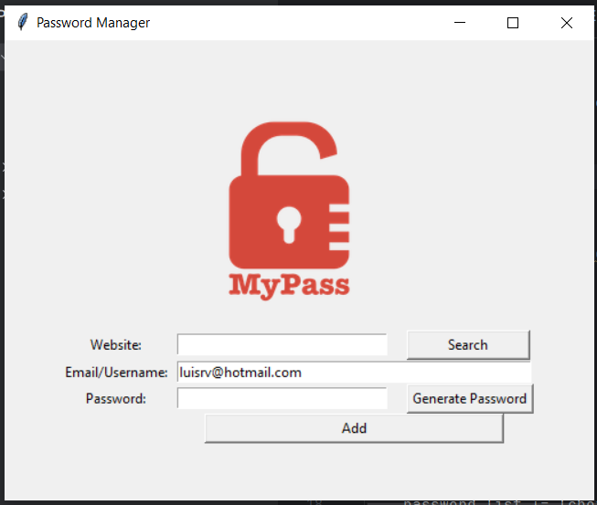
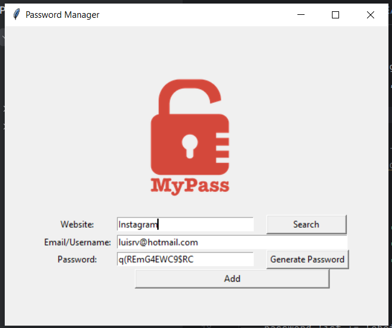
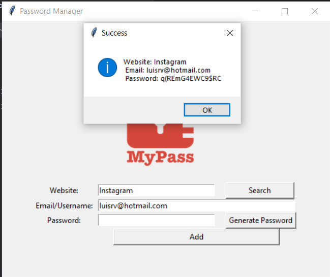

# Password Manager

This is a simple password manager application built using Python's Tkinter library. It allows users to store their website credentials securely and generate strong passwords.

## Features

- **Password Generation**: Users can generate strong passwords with random combinations of letters, numbers, and symbols.
- **Save Credentials**: Users can save website credentials including website URL, email/username, and password.
- **Search Functionality**: Users can search for saved credentials by entering the website URL.
- **Data Persistence**: All data is stored locally in a JSON file (`data.json`) for easy retrieval.

## How to Use

1. Clone the repository to your local machine.
2. Make sure you have Python installed on your system.
3. Install the required dependencies by running:

```bash
pip install tkinter pyperclip

```


### Run the application using the following command:

- python password_manager.py

### Use the application interface to generate passwords, save credentials, and search for saved credentials.

## Screenshots


## Contributors
- Luis Rodriguez Valido

